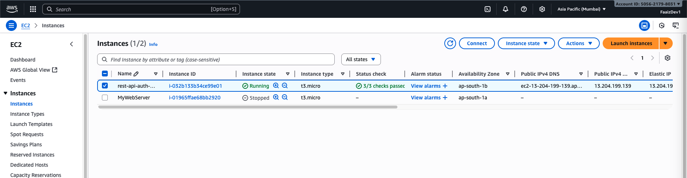

# 🚀 REST API – EC2 Deployment with GitHub Actions & PM2

This project demonstrates how to **deploy a Node.js REST API** on an **AWS EC2 Ubuntu instance**  
using **GitHub Actions**, **Nginx**, and **PM2**.

---

## 🧠 Tech Stack
- **Node.js + Express**
- **PM2** for process management
- **Nginx** as a reverse proxy
- **AWS EC2 (Ubuntu 24.04)**
- **GitHub Actions** for CI/CD automation

---

## 🛠️ Deployment Workflow Overview

1. **Code pushed to GitHub**
2. **GitHub Action** automatically runs
3. Code is deployed to **EC2**
4. **PM2** starts the app
5. **Nginx** forwards public traffic → backend API (port 3000)

---

## 📸 Deployment Proof (Step-by-Step)

### 🖥️ 1️⃣ EC2 Instance Running
Your EC2 instance is successfully running with a public IP.



---

### 💻 2️⃣ SSH Connection Established
Connected to EC2 instance using SSH.

```bash
ssh -i "rest-api-auth-ec2-git-runner.pem" ubuntu@ec2-13-204-199-139.ap-south-1.compute.amazonaws.com
```

✅ Successful login to Ubuntu instance.


---

### ⚙️ 3️⃣ PM2 Process (Backend Running)
PM2 keeps the app running continuously.

```bash
pm2 list
```

✅ Backend is online and monitored.


---

### 🌐 4️⃣ Nginx Configuration
Nginx reverse proxies external traffic to Node.js running on port 3000.

```nginx
location / {
    proxy_pass http://127.0.0.1:3000;
    proxy_http_version 1.1;
    proxy_set_header Upgrade $http_upgrade;
    proxy_set_header Connection 'upgrade';
    proxy_set_header Host $host;
    proxy_cache_bypass $http_upgrade;
}
```


---

### 🤖 5️⃣ GitHub Actions (Auto Deployment)
Every time code is pushed or PR merged, GitHub automatically deploys to EC2.


✅ Action succeeded — code deployed and backend restarted via PM2.

---

### 🧪 6️⃣ API Testing (Live Endpoint)
API successfully running on EC2 server.

Example Endpoint:
```
http://13.204.199.139/api/auth/register
```

✅ Working response (Postman / Browser):

![API Working]
(assets/06_api_response_register.png)
(assets/07_api_response_login.png)
(assets/08_api_response_profile.png)

---

## 📁 EC2 Folder Structure

```bash
/home/ubuntu/
├── actions-runner/
└── backend-rest-api-ec2-git-runner/
```


---

## 🔁 PM2 Auto Start Setup

To make sure PM2 restarts app after reboot:
```bash
pm2 startup
sudo env PATH=$PATH:/usr/bin pm2 startup systemd -u ubuntu --hp /home/ubuntu
pm2 save
```

---

## 🧩 Useful Commands

| Task | Command |
|------|----------|
| Restart App | `pm2 restart backend` |
| Stop App | `pm2 stop backend` |
| Show Logs | `pm2 logs backend` |
| Nginx Restart | `sudo systemctl restart nginx` |
| Check Runner Service | `sudo systemctl status actions.runner.*` |

---

## 🛡️ Security Note
- Never share your `.pem` file or GitHub Secrets  
- Do not expose `.env` variables publicly  
- Only port **80 (HTTP)** and **22 (SSH)** should be open in your EC2 security group

---

## ✨ Credits
**Author:** Faaiz Uddin  
**Project:** Backend REST API (Auth + Login + Profile)  
**Deployed on:** AWS EC2 using GitHub Actions + PM2 + Nginx  

---
